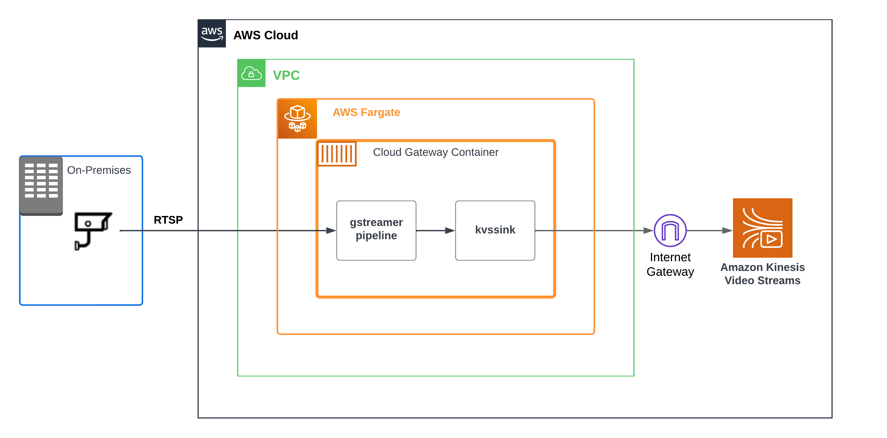
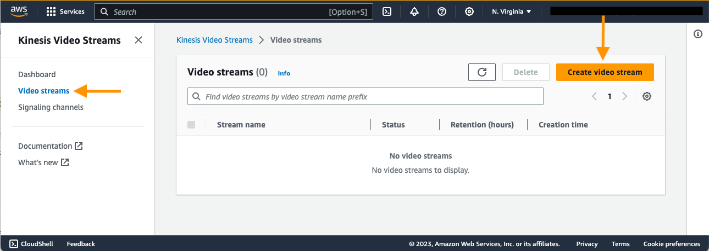
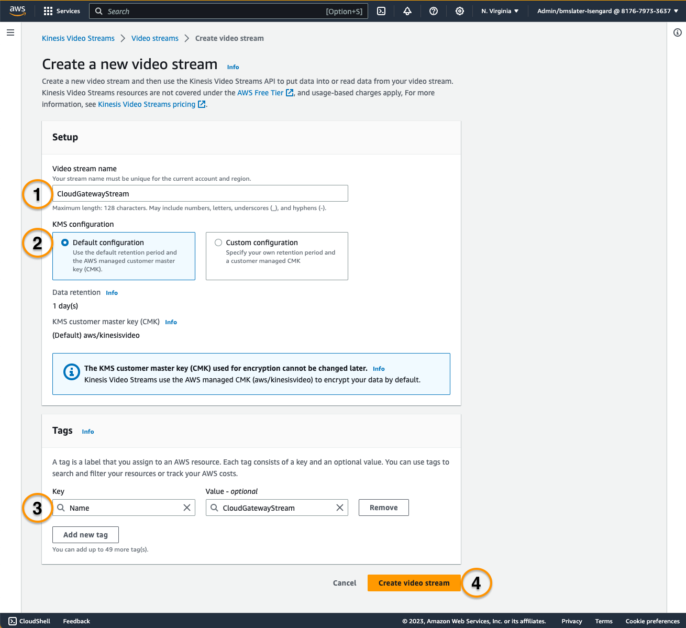
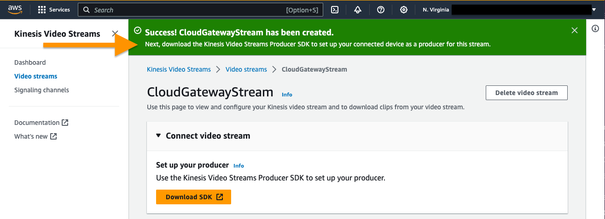

# Build a Cloud Gateway to Ingest RTSP video to Amazon Kinesis Video Streams

 
Kinesis Video Streams is a managed service that makes it easy for customers to securely send video data from camera devices to the cloud. Kinesis Video Streams provides you SDKs to make it easy to securely stream media to AWS, including a GStreamer plugin called kvssink. GStreamer is a popular open-source media framework that allows you to create custom media pipelines to greatly simplify integration with a multitude of cameras and video sources. This blog post focuses on building a cloud based gateway for customers that are unable to deploy new hardware on-premises, such as an NVR. The same type of approach could be used to implement the secure streaming of media from existing on-prem NVRs.
Overview
The architecture diagram below depicts the resources that this solution will deploy into your account. 


 
 
Figure 1: AWS Fargate-based gateway for ingestion of on-premises IP camera video streams from RTSP to Kinesis Video Streams solution architecture


The cloud gateway is deployed as an AWS Fargate application, although it could run on either Fargate or Amazon Elastic Compute Cloud (Amazon EC2). The application running on Fargate is comprised of a GStreamer media pipeline and utilizes the Kinesis Video Streams Producer SDK Gstreamer plugin which is part of the Kinesis Video Streams C++ Producer SDK. You will compile the Kinesis Video Streams Producer SDK, including the GStreamer plugin, in the AWS Fargate container. Therefore, the GStreamer multimedia framework and Kinesis Video Streams Producer SDK compile time dependencies will need to be installed as part of the Fargate Application. 

The Amazon Virtual Private Cloud (Amazon VPC) architecture in figure 1 above includes the use of an Internet gateway or Egress-only internet gateway. Depending on the bitrates of your RTSP streams and the total number of cameras you choose to integrate using the solution in this blog, use an Internet or Egress-only gateway to cost optimize network traffic. NAT gateway could be used, but NAT gateway isn’t the most cost optimized approach when ingesting video data from one or more IP cameras. For more information, see Amazon VPC Pricing. 
The architecture in figure 1 does not depict the use of AWS Direct Connect or an AWS Site-to-Site VPN, but these AWS services could be used to further secure the connection between your premises and the Amazon VPC. For more information see the Hybrid Networking Lens of the AWS Well-Architected Framework. 

## Prerequisites

*	An AWS account with full permissions on Kinesis Video Streams, EC2 or Fargate, and Amazon VPC
*	Familiarity with Linux operating systems and using the command-line 
*	Familiarity with compiling C++ applications and using CMake is helpful, but not required
*	A system with AWS CLI, AWS CDK, and docker tools installe 

## Walkthrough
 
To deploy and run the sample application we will perform the following steps:

* Create a Kinesis Video Stream
* Create an Amazon VPC with an Internet Gateway
* Create SSH Keypair and IAM user
* Create 
    * an Amazon EC2 to run the Cloud Gateway 
        OR
    * an Amazon EC2 with  install docker tools create the Cloud Gateway container 
        * Build an Ubuntu container with GStreamer and startup script
        * Create an Elastic Container Repository (ECR) to store the Ubuntu container
        * Create a Fargate cluster, task, and service and deploy the container. 
* View the video stream
* Clean Up


## Step 1: Create a Kinesis Video Stream*

*Create a Kinesis Video Stream*

Log into the AWS Management console.

 

Create the Video Stream. Example name: CloudGatewayStream.
 

Example of a Success Message
 
  

 If you prefer the AWS CLI, use the following commands.

```bash
aws kinesisvideo create-stream --stream-name "CloudGatewayStream" --data-retention-in-hours "24" --region us-east-1
```

*Example Command Output*
```json
{
    "StreamARN": "arn:aws:kinesisvideo:us-east-1:8xxxxxxxxxxx:stream/CloudGatewayStream/1682603545622"
}
```

## Step 2: Choose an EC2 or Fargate CDK

!

FARGATE-CDK-APP

## Step 3: View the Kinesis Video Stream
 


## Authors and acknowledgment
Show your appreciation to those who have contributed to the project.

## License
For open source projects, say how it is licensed.

## Project status
If you have run out of energy or time for your project, put a note at the top of the README saying that development has slowed down or stopped completely. Someone may choose to fork your project or volunteer to step in as a maintainer or owner, allowing your project to keep going. You can also make an explicit request for maintainers.
